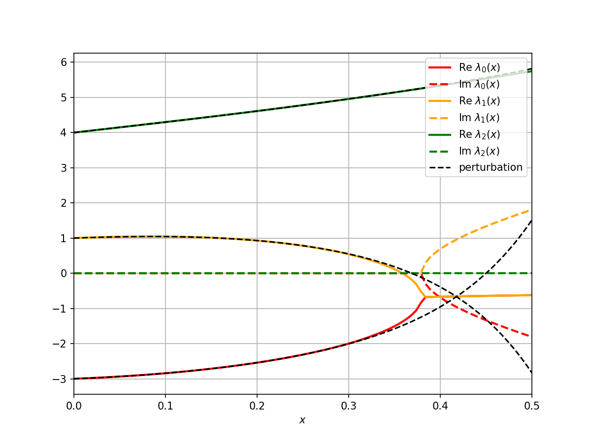

# Perturbation Series for linear Perturbations

The code computes the coefficients in the eigenvalue perturbation series for linear perturbations.
Before you proceed you should read the introduction of the [documentation](doc/doc.pdf).

Major caveat: Right now the code only works for matrices with float entries (no complex floats).

## Usage

- Type ```cabal run test``` to run the test described in the final section of the documentation.
- Type ```cabal run linear-perturbation-series``` to run the main program that allows you to enter the perturbation, reduced resolvent and the projection in the terminal

## Example

As an example of what the code allows us to do consider
```math
T_0 := 
\begin{pmatrix}
1 & 0 & 0 \\
0 & 4 & 0 \\
0 & 0 & -3
\end{pmatrix}
```
and
```math
T_0 := 1.0,-1.0,3.0],[-5.0,3.0,2.0],[-4.0,-8.0,1.0
\begin{pmatrix}
1 & -1 & 3 \\
-5 & 3 & 2 \\
-4 & -8 & 1
\end{pmatrix}.
```
Define $T: \mathbb{C} \to \mathbb{C}^{3 \times 3} $ by $T(x) = T_0 + x \cdot T_1$.
Say we want to know what happens to the eigenvalue 1 of $T(0)$ as $x$ increases.
Then the projection $P$ onto the eigenspace to eigenvalue 1 of $T_0$ is simply
```math
P = 
\begin{pmatrix}
1 & 0 & 0 \\
0 & 0 & 0 \\
0 & 0 & 0
\end{pmatrix}
```
and the reduced resolvent $S_1$ of $T_0$ at 1 is 
```math
S = 
\begin{pmatrix}
0 & 0 & 0 \\
0 & (1-4)^{-1} & 0 \\
0 & (1+3)^{-1} & 0
\end{pmatrix}.
```
The following terminal interaction shows how we calculate the perturbation series 
using the code:
```
[jd@jd-nixos:~/linear-perturbation-series]$ cabal run linear-perturbation-series
Enter dimension of vector space:
3
Enter projection P in row major order:
[1.0,0.0,0.0,0.0,0.0,0.0,0.0,0.0,0.0]
Enter perturbation T_1 in row major order:
[1.0,-1.0,3.0,-5.0,3.0,2.0,-4.0,-8.0,1.0]
Enter reduced resolvent S in row major order:
[0.0,0.0,0.0,0.0,-0.3333333,0.0,0.0,0.0,0.25]
Enter desired perturbation order:
9
Calculated perturbation series coefficients:
[1.0,-4.6665,-9.554711,-0.7601011,-14.0054865,-7.2533092,-78.31503,-68.54976,-252.03307]
```
The returned list are the coefficients in the perturbation series.
Therefore the eigenvalue $\lambda(x)$ of $T(x)$ with $\lambda(0)=1$ is approximately given by
$$
\lambda (x) \approx 1 + 1.0 \cdot x - 4.665 \cdot x^2 -9.554711 x^3 -0.7601011 \cdot x^4
-14.0054865 \cdot x^5 -7.2533092 \cdot x^6 -78.31503\cdot x^7 -68.54976 \cdot x^8
-252.03307 \cdot x^9.
$$
The same thing can be done for the other 2 eigenvalues of $T_0$ (3 and -4).

The so obtained series for the eigenvalues can be compared to the eigenvalues obtained
using a linear algebra library.
The result is the following:

